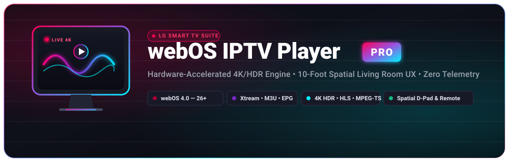

# webOS IPTV Player Pro 📺

<div align="center">



[](https://www.webosose.org/)
[](https://react.dev/)
[](https://www.typescriptlang.org/)
[](https://tailwindcss.com/)
[](https://vitejs.dev/)
[](LICENSE)

<p align="center">
  <strong>Production-ready, high-performance IPTV & VOD streaming application crafted specifically for LG webOS Smart TVs and 10-foot living room displays.</strong>
</p>

<p align="center">
  <a href="#-key-features">Key Features</a> •
  <a href="#-how-to-build">How to Build</a> •
  <a href="#-how-to-install-on-lg-tv">Installation Guide</a> •
  <a href="#-remote-control-mapping">Remote Control</a> •
  <a href="#-project-architecture">Architecture</a> •
  <a href="#-faq--troubleshooting">FAQ</a>
</p>

</div>

---

## 🌟 Executive Summary

**webOS IPTV Player Pro** is a modern streaming television platform engineered to run seamlessly on LG Smart TVs from **webOS 4.0 (Chromium 53 baseline)** through the newest **webOS 26+ OLED TVs**.

It combines a **hardware-accelerated media pipeline** with an ultra-responsive, virtualized user interface designed specifically for the **10-foot living room viewing distance** (tested on 42", 55", 65", and 77" 4K displays).

The app runs with **100% privacy and zero external telemetry**: all playlists, Xtream credentials, EPG guides, and watch history remain strictly on your local device.

---

## ✨ Key Features

### 📺 10-Foot Living Room UX & 42"+ Display Calibration
- **Spatial D-Pad & Magic Remote Navigation**: Seamless directional navigation with predictable focus rings, wrap-around support, and air-mouse pointer compatibility.
- **Aspect Ratio & Scale Optimization**: Strict typographic scales, comfortable padding, and high-contrast badges designed for large displays without blur or awkward overlapping.
- **True OLED Black Mode (`#000000`)**: Complete pixel shutdown on LG OLED screens to maximize contrast ratio and prevent screen burn-in.
- **Top Bar System Monitor & Digital Clock**: Live digital clock updating every minute, instant Parental PIN lock status, sleep timer indicator, and diagnostic quick toggles.

### ⚡ Multi-Engine Hardware Media Pipeline
- **Native HTML5 Hardware Decoder (Default)**: Direct hardware decode on LG SoC chips (<5% CPU usage) supporting 4K UHD, HDR10, HLG, Dolby Vision, and Dolby Atmos / DD+ eARC passthrough.
- **MSE JavaScript Demuxer (`hls.js`)**: Real-time demuxing for complex multi-language manifests, alternate audio tracks, and Low-Latency HLS.
- **HTTP-TS Demuxer (`mpegts.js`)**: Direct demuxing of raw MPEG-TS HTTP broadcast streams into ISO BMFF FMP4 segments on-the-fly.
- **DASH / DRM Engine (`Shaka Player`)**: Dynamic support for MPEG-DASH (`.mpd`) streams, ClearKey, and Widevine DRM.
- **Stall Watchdog & 4-Stage Auto-Recovery**: Detects playback stalls within 3.5 seconds and executes an automatic recovery sequence:
  1. *Soft Nudge* (+0.5s buffer advance)
  2. *Engine Hot-Swap* (Native ↔ MSE)
  3. *Hard Stream Reload*
  4. *Next Channel Fallback*

### 📡 Playlist Management & Parsing Engine
- **M3U / M3U8 Playlists**: Supports HTTP/HTTPS URLs, local file uploads, and raw playlist text.
- **Xtream Codes API**: Full native integration with Xtream accounts (Live Streams, VOD Movies, and TV Series with Seasons & Episodes).
- **Multi-Threaded Web Worker**: Asynchronous streaming parser parses 50,000+ items smoothly in the background without dropping UI frame rates.
- **Smart Channel Logo Resolution**: Extracts `tvg-logo` / `logo` tags with fallback matching to official high-resolution vector logos and SSL proxying to prevent mixed-content blocks.

### 🎬 IMDb & VOD Metadata Enrichment
- **Automated IMDb / TMDB Metadata**: Fetches high-resolution posters, backdrops, IMDb ratings, plot synopses, genres, release years, directors, and cast.
- **One-Click Auto Enrichment**: Enrich entire movie catalogs with IMDb data with local caching in IndexedDB for instant offline access.
- **Detail Modals & Resume Playback**: Fullscreen hero modal showing cast, trailer previews, synopsis, audio tracks, and resume time.

### 📅 EPG (Electronic Program Guide) & Live DVR
- **3-Pane TV Schedule Grid**: Interactive timeline with live progress bars, upcoming programs, and past catch-up time-shifting.
- **Catch-Up & Timeshift Playback**: Rewind or pause live television and jump back to the live broadcast edge with a single button.
- **Channel Dialing Overlay**: Type 1–4 digits using the remote's numeric keypad to dial channels directly.

### 📱 LAN Mobile Companion & QR Upload
- **Zero Remote Typing**: Scan an on-screen QR code from your smartphone, tablet, or laptop on the same local network to upload M3U files or type Xtream credentials.

### 🔒 Parental Controls & Sleep Timer
- **PIN-Protected Categories**: Lock adult or custom groups behind a secure 4-digit master PIN.
- **Sleep Timer**: Set automatic playback stop after 15, 30, 45, 60, 90, or 120 minutes.

---

## 🎮 Remote Control Mapping

| LG Magic Remote | Web Browser / Keyboard | Player Mode | Channel Browser | EPG Guide |
|:---|:---|:---|:---|:---|
| **D-Pad Up / Down** | `↑` / `↓` Arrow Keys | Previous / Next Channel | Navigate Channels | Navigate Channels |
| **D-Pad Left / Right** | `←` / `→` Arrow Keys | Seek ±10 seconds | Switch Groups ↔ Channels | Navigate Timeline |
| **OK / Click Wheel** | `Enter` / `Space` | Toggle OSD Controls | Play Channel | Open Details / Play |
| **Back / Return** | `Escape` / `Backspace` | Close OSD → Exit to Live | Close List | Return to Live |
| **🔴 Red Button** | `R` Key | Open TV Guide (EPG) | Jump to First Channel | Return to Live |
| **🟢 Green Button** | `G` Key | Toggle Favorite | Toggle Favorite | Jump to "Live Now" |
| **🟡 Yellow Button** | `Y` Key | Stream Diagnostics OSD | Cycle Sort (Name/Num) | Search Schedule |
| **🔵 Blue Button** | `B` Key | Open Settings View | Toggle Compact/Comfortable | Open Settings |
| **0 – 9 Numbers** | `0` – `9` Keys | Direct Channel Dialing | Direct Channel Dialing | — |
| **Channel ▲ / ▼** | `Page Up` / `Page Down` | Channel Step ±1 | Page Up / Down (10 Ch.) | Channel Page Step |
| **Play / Pause / Stop**| `K` / `P` | Hardware Media Control | — | — |

> 💡 **Browser Testing**: Click the **Remote Sim** button in the top navigation bar to display an interactive, floating LG Magic Remote simulator with pointer and D-pad controls!

---

## 🚀 Quick Start (Development)

### Prerequisites
- **Node.js**: v20.x or later
- **npm**: v10.x or later

### 1. Clone & Install Dependencies
```bash
git clone https://github.com/your-username/webos-iptv-player-pro.git
cd webos-iptv-player-pro
npm install
```

### 2. Start the Development Server
```bash
npm run dev
```
The application will launch on `http://localhost:3000` with the Express companion server and Vite middleware.

### 3. Run Quality Checks
```bash
# Type check without emitting
npm run lint
```

---

## 🛠️ How to Build

The project includes an automated, end-to-end production build pipeline that targets the LG webOS runtime and outputs a standalone `.ipk` application package:

```bash
# Option A: Run the all-in-one build script
chmod +x build.sh
./build.sh
```

### What happens under the hood during the build:
1. **Type Verification**: `npm run lint` (`tsc --noEmit`) validates all TypeScript components, services, and types.
2. **Production Bundle**: `npm run build` compiles and minifies the React 19 app with Vite, generating legacy-compatible ES modules for Chromium 53+.
3. **Asset Generation**: `node generate-icons.mjs` creates the required webOS TV icons (`icon.png` 80x80, `largeIcon.png` 130x130, splash screens).
4. **IPK Packaging**: `node package-ipk.mjs` generates the self-contained installation file:
   ```
   com.webos.iptv.pro_1.0.0_all.ipk
   ```

---

## 📦 How to Install the Bundle (.ipk) on Your LG TV

You have multiple methods to install the compiled `com.webos.iptv.pro_1.0.0_all.ipk` package onto your LG webOS Smart TV, ranging from beginner-friendly graphical apps to advanced developer CLI and Homebrew options. Choose the method that best matches your setup:

| Method | Best For | Root Required? | Difficulty |
|:---|:---|:---:|:---:|
| **[Method 1: webOS Dev Manager](#method-1-webos-dev-manager-recommended---easiest-gui)** | Windows / macOS / Linux PC users | ❌ No | ⭐ Easy |
| **[Method 2: Official LG webOS CLI (`ares-install`)](#method-2-official-lg-developer-cli-ares-cli)** | Developers & Terminal enthusiasts | ❌ No | ⭐⭐ Moderate |
| **[Method 3: webOS Homebrew Channel](#method-3-webos-homebrew-channel-app-repository)** | Jailbroken / Rooted LG TVs | ✔️ Yes (or Dev Mode) | ⭐ Easy |
| **[Method 4: Direct SSH / Terminal (`luna-send-pub`)](#method-4-direct-ssh--sideloading-rooted--developer-mode)** | Advanced users & scripts | ✔️ Yes / Dev SSH | ⭐⭐⭐ Advanced |
| **[Method 5: USB Drive (Development Preview)](#method-5-usb-drive-test-preview--drm-free-mode)** | Quick testing without PC network connection | ❌ No | ⭐ Easy |

---

### Method 1: webOS Dev Manager (Recommended - Easiest GUI)

**webOS Dev Manager** is an open-source desktop application (Windows, macOS, and Linux) that provides a polished drag-and-drop interface for managing apps, services, and files on LG TVs.

#### Step 1: Prepare Your TV
1. Turn on your LG TV and open the **LG Content Store** (or **Apps** app on webOS 6.0+).
2. Search for **Developer Mode** and install the official app.
3. Launch the **Developer Mode** app.
4. Sign in with your free LG Developer account (create one free at [webostv.developer.lge.com](https://webostv.developer.lge.com/) if needed).
5. Toggle **Developer Mode** to **ON**.
6. Toggle **Key Server** to **ON**.
7. Note the **IP Address** and **Passphrase** displayed on the screen.

> 💡 **Keep Dev Session Alive:** Under Developer Mode, LG gives you a 50-hour session countdown. webOS Dev Manager has an automatic background session renewal feature so your apps never expire!

#### Step 2: Connect from Your PC
1. Download **[webOS Dev Manager](https://github.com/webosbrew/dev-manager-desktop/releases)** on your PC.
2. Launch the app and click **Add Device** (+ icon).
3. Enter a device name (e.g., `Living Room TV`) and your TV's **IP Address**.
4. Set the connection type to **Developer Mode**.
5. Enter the **Passphrase** shown on your TV screen, then click **Connect / Save**.

#### Step 3: Install the App
1. Build or download `com.webos.iptv.pro_1.0.0_all.ipk`.
2. In webOS Dev Manager, navigate to the **Apps** tab.
3. Click **Install...** (or drag and drop the `.ipk` file into the window).
4. Select `com.webos.iptv.pro_1.0.0_all.ipk` and confirm.
5. In 5–10 seconds, the app will appear in your TV's webOS launcher ribbon!

---

### Method 2: Official LG Developer CLI (`ares-cli`)

For developers with the [webOS TV SDK / CLI](https://webostv.developer.lge.com/develop/tools/cli-installation) installed on their workstation:

#### Step 1: Configure Your TV Target
Ensure Developer Mode and Key Server are enabled on your TV as described in Method 1. Then pair your computer with the TV:
```bash
# Add TV target (replace 192.168.1.50 with your TV IP)
ares-setup-device -a tv -i 192.168.1.50 -p 9922 -u prisoner

# Fetch the developer SSH authentication key
# (You will be prompted for the passphrase displayed in the TV Developer Mode app)
ares-novacom --device tv --getkey
```

#### Step 2: Install and Launch
```bash
# Install the compiled package to your TV
ares-install -d tv com.webos.iptv.pro_1.0.0_all.ipk

# Immediately cold-launch the player on the TV screen
ares-launch -d tv com.webos.iptv.pro

# Optional: Inspect live runtime logs and console output
ares-launch -d tv -i com.webos.iptv.pro
```

You can also automate build and deployment in one step using the included script:
```bash
./build.sh --install tv
```

---

### Method 3: webOS Homebrew Channel (App Repository)

If your TV is rooted (e.g. via [RootMy.TV](https://rootmy.tv/) or [dejavulnerable](https://github.com/throwaway96/dejavulnerable-webos)) and has the **Homebrew Channel** installed:

#### Option A: Direct Local Sideload via Web Portal
1. Open the **Homebrew Channel** on your LG TV.
2. In the Homebrew Channel Settings, ensure **Local HTTP Server** is enabled.
3. Open a browser on your PC or smartphone and go to your TV's IP address: `http://<TV_IP_ADDRESS>:1234/`.
4. Upload `com.webos.iptv.pro_1.0.0_all.ipk` via the web interface.
5. Tap **Install** — the app installs immediately with root privileges (no 50-hour session timeout).

#### Option B: Self-Hosted Custom Repo
1. Place `com.webos.iptv.pro_1.0.0_all.ipk` and a small `repo.json` manifest on your home NAS or local HTTP server:
   ```json
   {
     "packages": [
       {
         "id": "com.webos.iptv.pro",
         "version": "1.0.0",
         "name": "webOS IPTV Player Pro",
         "type": "native",
         "description": "High-performance hardware-accelerated IPTV & VOD Player for LG webOS",
         "icon": "https://your-server/icon.png",
         "sourceUrl": "https://your-server/com.webos.iptv.pro_1.0.0_all.ipk"
       }
     ]
   }
   ```
2. In the Homebrew Channel settings on your TV, add `http://your-server/repo.json` under **Custom Repositories**.
3. Browse the store, select **webOS IPTV Player Pro**, and click **Install**.

---

### Method 4: Direct SSH / Sideloading (Rooted / Developer Mode)

If you have SSH access to your TV (via developer mode on port 9922 or root SSH on port 22):

1. **Transfer the package via SCP:**
   ```bash
   scp -P 9922 com.webos.iptv.pro_1.0.0_all.ipk prisoner@192.168.1.50:/tmp/
   # Or for rooted TV (port 22):
   # scp com.webos.iptv.pro_1.0.0_all.ipk root@192.168.1.50:/tmp/
   ```

2. **SSH into the TV and trigger the Luna Bus Installer:**
   ```bash
   ssh -p 9922 prisoner@192.168.1.50

   # Install the package using the native webOS application manager bus
   luna-send-pub -i -u palm://com.webos.appInstallService/install \
     '{"id":"com.webos.iptv.pro","ipkUrl":"/tmp/com.webos.iptv.pro_1.0.0_all.ipk","subscribe":true}'
   ```

3. **Launch the application:**
   ```bash
   luna-send-pub -n -u palm://com.webos.applicationManager/launch \
     '{"id":"com.webos.iptv.pro"}'
   ```

---

### Method 5: USB Drive (Test Preview / DRM-free Mode)

For rapid visual testing without setting up SSH or wireless pairing tools:

1. Format a USB flash drive as **FAT32** or **NTFS**.
2. Create a folder named `developer` in the root of the USB drive.
3. Inside, create a subfolder named `apps` and unpack the production `dist/` build files into `developer/apps/usr/palm/applications/com.webos.iptv.pro/`.
4. Insert the USB drive into your LG TV's USB port.
5. On supported webOS developer builds or TVs running webOS Developer Mode, the USB application will appear in the home ribbon under the USB device icon.

---

### 💡 Installation Troubleshooting & Tips

* **Session Expired (Dev Mode)**: Developer Mode apps expire after 50 hours unless renewed. In webOS Dev Manager, enable **Auto-renew developer session** in device settings, or click **Extend** in the TV's Developer Mode app. Rooted installations do not have this limitation.
* **Certificate / Signature Mismatch**: The package created by `package-ipk.mjs` uses the Debian AR container format standard compatible with webOS internal un-signed sideloading (`com.webos.appInstallService`). If your TV complains about signature verification, ensure Developer Mode is active.
* **App Disappeared After TV Reboot**: On some older webOS versions, developer apps are purged on deep reboot if the Developer Mode app is not running. Simply reopen the **Developer Mode** app on the TV to refresh the installed package list.
* **Network Connectivity**: Ensure both your PC and LG TV are connected to the same local network subnet (2.4GHz / 5GHz Wi-Fi or Ethernet). If connection fails, check whether your router has client isolation (AP isolation) enabled.

---

## 🏗️ Project Architecture

```
webos-iptv-player-pro/
├── bundled-service/            # webOS background Node.js service (LAN upload portal)
│   ├── package.json
│   └── service.js
├── public/                     # Static icons, manifests, and sample assets
│   ├── icon.png
│   ├── largeIcon.png
│   └── logo.svg
├── src/
│   ├── components/
│   │   ├── Common/             # Reusable 10-foot components
│   │   │   ├── ChannelLogo.tsx     # Smart logo renderer with vector fallbacks
│   │   │   ├── PinEntryModal.tsx   # Parental lock 4-digit PIN dialog
│   │   │   ├── RemoteSimulator.tsx # Virtual LG Magic Remote overlay
│   │   │   └── VirtualList.tsx     # 60fps high-density virtualized list
│   │   ├── Epg/                # Electronic Program Guide (3-pane timeline)
│   │   ├── LiveTv/             # Live TV browser & channel navigation
│   │   │   └── ChannelBrowser.tsx  # Optimized list header & channel cards
│   │   ├── Navigation/         # Top navigation bar, clock & page switcher
│   │   ├── Player/             # 10-foot OSD, buffer health & number overlay
│   │   │   └── VideoPlayer.tsx     # Unified multi-engine player
│   │   ├── Settings/           # Settings view (Playback, Audio, Display, PIN)
│   │   └── Vod/                # Movies & Series browser with IMDb enrichment
│   │       └── VodBrowser.tsx      # VOD cards, episode picker & detail modal
│   ├── services/
│   │   ├── ChannelLogoService.ts   # Logo resolution, proxying & curated vectors
│   │   ├── DefaultChannels.ts      # Built-in live demo channels
│   │   ├── EpgService.ts           # XMLTV guide parser & catch-up calculator
│   │   ├── ImdbService.ts          # Cinemeta/IMDb metadata fetching & cache
│   │   ├── PlaybackEngine.ts       # 4-stage stall watchdog & engine switcher
│   │   ├── PlaylistParser.ts       # Standard M3U parser
│   │   ├── StreamingPlaylistParser.ts # Multi-threaded streaming parser
│   │   ├── StorageService.ts       # IndexedDB & localStorage persistence
│   │   └── XtreamService.ts        # Xtream Codes Live/VOD/Series client
│   ├── workers/
│   │   └── playlist-worker.ts      # Web Worker for parsing massive playlists
│   ├── App.tsx                 # Root application controller & keyboard listeners
│   └── main.tsx                # Entry point & global CSS injection
├── appinfo.json                # webOS application manifest
├── build.sh                    # Unified production build shell script
├── generate-icons.mjs          # Icon generator script
├── package-ipk.mjs             # IPK packaging script
├── server.ts                   # Express server & LAN companion daemon
└── vite.config.ts              # Vite bundler configuration
```

---

## 🎬 Supported Formats & Codecs

| Category | Supported Formats |
|:---|:---|
| **Streaming Protocols** | HLS (`.m3u8`), MPEG-TS over HTTP (`.ts`), MPEG-DASH (`.mpd`), MP4/MKV progressive HTTP |
| **Playlist Formats** | M3U, M3U8, M3U Plus (`tvg-name`, `tvg-logo`, `group-title`), Xtream Codes API v2 |
| **Video Codecs** | H.264 / AVC, H.265 / HEVC, VP9, AV1 (on supported 2021+ LG SoCs) |
| **Audio Codecs** | AAC-LC, HE-AAC, MP3, AC-3 (Dolby Digital), E-AC-3 (Dolby Digital Plus), Dolby Atmos |
| **Video Profiles** | 720p, 1080p, 4K UHD, HDR10, HLG, Dolby Vision |

---

## ❓ FAQ & Troubleshooting

<details>
<summary><strong>1. Why won't some HTTP streams play on HTTPS? (Mixed Content)</strong></summary>

Modern web browsers block unencrypted `http://` streams when the app is served via `https://` (Mixed Content security policy).  
When running as an installed **webOS `.ipk` application on your TV**, the app runs on the `file://` or custom local scheme where this restriction is relaxed. When developing in a web browser, use the built-in stream proxy or configure an HTTPS stream URL.
</details>

<details>
<summary><strong>2. What is the difference between Compact and Comfortable list views?</strong></summary>

- **Compact View**: Designed for rapid browsing through large channel rosters (50+ channels per page view). Focuses on channel number, clean logo, and name.
- **Comfortable View**: Displays rich details including current program synopsis, progress bar, audio language badges, and category labels.  
Toggle between modes anytime using the **Compact / Comfortable icon button** or the **🔵 Blue remote button**.
</details>

<details>
<summary><strong>3. How does IMDb fetching work for VOD?</strong></summary>

The player queries free, CORS-open media catalog APIs (Cinemeta / TMDB mirrors) using cleaned title and release year matching. Retrieved posters, IMDb ratings, director information, and synopses are stored in your TV's local IndexedDB so they load instantaneously without consuming network bandwidth.
</details>

<details>
<summary><strong>4. How do I protect adult channels with a PIN?</strong></summary>

Go to **Settings → Parental Control**, toggle Parental Lock on, and enter a 4-digit master PIN (default: `0000`). Any channel group with adult keywords (or groups you manually flag) will require the PIN before displaying video or channel listings.
</details>

<details>
<summary><strong>5. Will this app work on Samsung Tizen or Android TV?</strong></summary>

While specifically packaged with webOS icons and `appinfo.json` for LG TVs, the entire frontend is standard React 19 / HTML5. It runs smoothly on any Chromium-based Smart TV browser or Android TV WebView.
</details>

---

## 🔒 Privacy & Security

- **Zero Cloud Servers**: webOS IPTV Player Pro does not connect to any proprietary analytics or metrics servers.
- **Direct Streaming**: Media streams connect directly from your TV to your IPTV provider.
- **On-Device Storage**: Your playlist URLs, Xtream login credentials, favorites, and settings are saved securely in your TV's local storage.

---

## 📄 License

Distributed under the **MIT License**. See `LICENSE` for more information.
All trademarks, logos, and brand names are the property of their respective owners.
